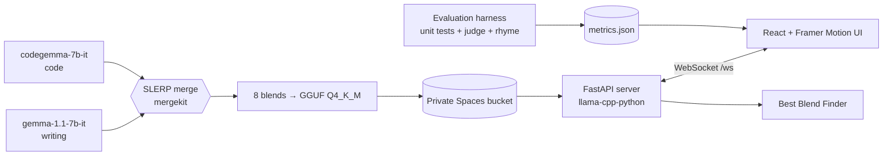

<div align="center">

# ⛵ Nap in a Boat · BlendLab

### Two language models. One slider. See the trade-off.

Blend a **writing model** and a **coding model** with SLERP, drag a handle along a wavy line, and watch the *same prompt* change from poetry to code.

[](https://github.com/Celaidon/Nap-in-a-boat/actions/workflows/ci.yml)


<!-- 🎬 HERO GIF PLACEHOLDER
     Record a 10-15 second screen capture: drag the slider from 0% to 100% with the same prompt.
     Save it as assets/hero.gif, then replace this comment with:
      -->

>  · slider drag, same prompt, three different answers

**[Live demo]()** · 
</div>

---

## ✨ The idea in 30 seconds

A language model is just a big pile of numbers. Two models fine-tuned from the **same parent** have the *same shape*, so their numbers can be combined position by position. No training, no GPUs for hours: only math on weight files.

- **t = 0** → Model A, `gemma-1.1-7b-it`: instruction-tuned, good at writing and conversation
- **t = 1** → Model B, `codegemma-7b-it`: instruction-tuned code model built from the same Gemma 7B base
- **in between** → **SLERP** (spherical interpolation) along an arc, which keeps the weights' magnitude healthy instead of cutting a straight line through the middle

We precompute **eight blends**, serve them live, **measure every one**, and plot the trade-off. If a clever layer-wise blend beats every plain slider position, that's the headline finding. If the middle turns out to be broken, we say so. Honest numbers only.

| Blend | What it is | Slider |
|---|---|---|
| `sweep_000` | Model A itself (converted, not merged) | 0% |
| `sweep_025` · `sweep_050` · `sweep_075` | Plain SLERP | 25% · 50% · 75% |
| `sweep_100` | Model B itself | 100% |
| `split_attn_code` | **Attention** layers mostly from the code model, MLP mostly from the writing model | 50% |
| `split_mlp_code` | **MLP** layers mostly from the code model, attention from the writing model | 50% |
| `gradient_mid` | Code influence **peaks in the middle layers** (`[0, .5, 1, .5, 0]`) | 50% |

---

## 🖥️ What you get

<table>
<tr>
<td width="50%">

**A chat that tells you who's talking.** Every answer carries a chip: which blend, which quantization, how fast it ran.


</td>
<td width="50%">

**A wavy-line slider.** Writing model top-left, code model middle-right, a handle on the wave that snaps to real blends. A context-window meter rides along.


</td>
</tr>
<tr>
<td>

**Compare mode.** One prompt, two blends, side by side.


</td>
<td>

**The capability curve.** Code pass rate vs. writing style score for every blend, with the slider position marked and a big-model reference line.


</td>
</tr>
<tr>
<td>

**Best Blend Finder.** Paste up to three of *your* tasks; the server tests every blend and recommends one.


</td>
</tr>
</table>

---

## 🚀 Quick start

You need **Python 3.11** and **Node 20+**.

```bash
git clone https://github.com/Celaidon/Nap-in-a-boat.git
cd Nap-in-a-boat
cp .env.example .env                       # then fill in only the keys you need
python3.11 -m venv .venv
source .venv/bin/activate                  # Windows: .venv\Scripts\activate
pip install -r requirements/server.txt
cd web && npm ci && npm run build && cd ..
```

Pick **one** of three ways to run it:

### 1️⃣ Demo mode: no server, no keys, 30 seconds
```bash
cd web && npm run dev
```
Open **http://localhost:5173/?mock=1**. Everything is fake data from `contracts/mocks`. Great for looking around.
In the browser console, `blendlabMock.drop()` simulates a lost connection and `blendlabMock.restore()` heals it.

### 2️⃣ Simulated mode: real streaming from a hosted API
For demos while the merged models aren't ready. Answers come from Groq, Gemini or OpenRouter. **It is not the SLERP blend**, and the UI says so in a permanent banner.
```bash
# .env
SIM_PROVIDER=groq            # groq | gemini | openrouter
SIM_API_KEY=<your key>
SIM_WRITING_MODEL=<model id from the provider>
SIM_CODE_MODEL=<optional, used above 50%>

uvicorn src.server.main:app --port 8000
```
Open **http://localhost:8000**. Details in [`docker/SIMULATED.md`](docker/SIMULATED.md).

### 3️⃣ Real mode: the merged GGUF models
```bash
# .env: MODELS_DIR, DO_SPACES_* so the server can fetch the files, REGISTRY_PATH=models/registry.json
uvicorn src.server.main:app --port 8000
```
The server downloads each blend from the private Spaces bucket on first use, **verifies its SHA-256**, and keeps at most `MAX_LOADED_MODELS` in memory (least recently used leaves first).
For a quick local test with any single `.gguf` file: `DEV_MODEL_OVERRIDE=path/to/model.gguf uvicorn src.server.main:app`.

---

## 🧠 How it works



**Why we can merge these two at all.** Check **A1** compared the actual Gemma weights: **254 tensors, 0 shape mismatches, identical tokenizer and config, 28 layers each**. Same parent, same skeleton, so position-by-position math is valid. ([`verification/A1.json`](verification/A1.json))

**Under the hood**
- **Streaming that never blocks.** `llama-cpp-python` is blocking, so inference runs in a worker thread and tokens cross to the event loop through a queue. `/health` answers in single-digit milliseconds *while* a model generates.
- **One lock per model.** A `Llama` object must never run two generations at once, so each model has a lock and a short queue; extra requests get a clear `busy`.
- **Clean cancellation.** Cancel or disconnect stops the worker thread within a token, and the lock is released only after the thread has really stopped.
- **Checksums, always.** A downloaded file with the wrong SHA-256 is deleted and rejected.
- **Contracts first.** Three people built three tracks in parallel against frozen JSON schemas in [`contracts/`](contracts/), and every check writes a proof file to [`verification/`](verification/).

### The WebSocket in one glance

| Client → server | Server → client |
|---|---|
| `generate {blend_id, prompt, max_tokens, temperature}` | `token`, then `done {tokens, tokens_per_sec}` |
| `cancel {request_id}` | `error` with code `cancelled` |
| `find_best {tasks ≤ 3}` | `progress {step, of, blend_id}`, then `result {best_blend_id, scores}` |
| `pong` | `ping` every 20 s |

Error codes: `unknown_blend` · `busy` · `bad_request` · `cancelled` · `internal`. REST: `GET /health` · `/api/registry` · `/api/metrics`.

---

## 📊 Results

Every number in this README comes from [`results/metrics.json`](results/metrics.json). We measure each blend on:

- **Coding**: pass rate on unit-tested problems (MBPP sanitized, run in an isolated sandbox with a timeout and no network)
- **Writing style**: scored by a judge model on our own prompts, plus a rhyme-and-meter checker
- **Speed**: tokens per second
---

## 🧱 Project layout

```
contracts/    frozen schemas + mocks shared by all tracks
src/merge/    Track A: pair check, SLERP merges, GGUF conversion
src/eval/     Track B: datasets, sandbox, judge, rhyme, scoring
src/server/   Track C: FastAPI, WebSocket, model manager, Finder, simulated mode
web/          React + Vite + Framer Motion app (see web/README.md)
docker/       Dockerfile (builds the UI too), deploy runbook
scripts/      smoke test, deploy helpers, repo validation
verification/ one JSON proof per check (A1, B2, C3, ...)
```

**Run the tests**
```bash
pytest -m "not models"        # Python, nothing here needs real model files
cd web && npm test            # frontend
python scripts/validate_repo.py   # schemas, no model files or secrets committed
```

---

## 🌊 Live demo

> 🔗 **[  ]** ·  
> 🎥 **[ https://drive.google.com/file/d/1-95cKjrOo-gf8OZ8Hss4ALBcQk4UxYk_/view?usp=sharing ]**

---

## 👥 Team

| Track | Who | Built |
|---|---|---|
| **A · Models & Merging** | Vani Mishra | Pair verification, SLERP merges, GGUF conversion, registry |
| **B · Evaluation** | Muskan Khushi | Datasets, safe code runner, judge, rhyme scorer, capability curve |
| **C · Backend, Infra & Frontend** | Sharva Rajesh Jadhav | FastAPI + WebSocket server, model manager, Docker, CI, deployment, the React app |

<sub>Built for Hacktoberfest 2026.</sub>

---

## ⚖️ Model terms and licenses

- **Our code**: [Apache-2.0](LICENSE).
- **Gemma models** are covered by [Google's Gemma Terms of Use](https://ai.google.dev/gemma/terms), which is **not** an open-source license. Everyone who downloads the weights must accept the terms on each model's Hugging Face page. Merged and quantized derivatives carry the same terms, including the Prohibited Use Policy. We keep the GGUF files in a **private** bucket and do not redistribute them.
- **Datasets**: MBPP (sanitized) is CC BY 4.0. Our style prompts and test poems are original. See [NOTICE](NOTICE).
- **Simulated mode** sends your prompts to the API provider you choose; check their terms. Keys live only in `.env` and are never committed.
- **We don't put "Gemma" in the project name**, because Google's terms don't allow names that imply endorsement.

<div align="center">

*Mid-range blends can produce odd text. That's part of the finding, not a bug we hid.*

</div>
